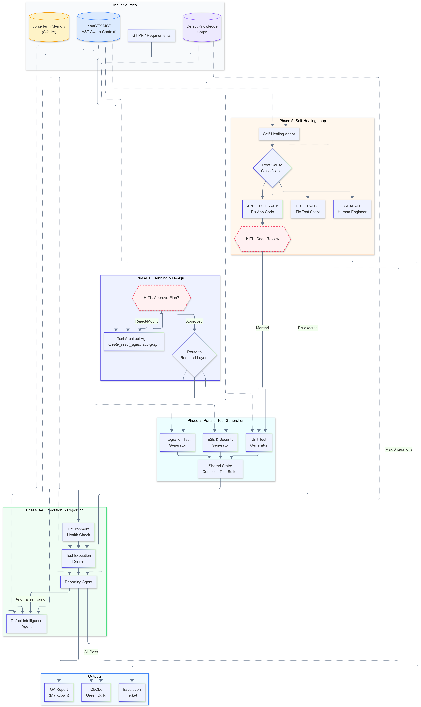

# QAura

Autonomous software testing and self-healing multi-agent system built with LangGraph.

QAura orchestrates 8 specialized AI agents through a 5-phase pipeline that follows the Software Testing Life Cycle (STLC): plan tests, generate them, execute them, analyze failures, and automatically heal broken tests or draft application code fixes — with human approval gates at critical decision points.

You provide your application source code and a requirements document. QAura does the rest.

## Architecture



### Agents

| Agent | Phase | Role |
|-------|-------|------|
| **Test Architect** | 1 | Reads requirements, discovers project structure via RAG, produces a structured test plan with risk-prioritized components |
| **HITL Approval** | 1 | Pauses execution for human review of the test plan. Supports rejection with feedback for revision (max 3 rounds) |
| **Unit Test Generator** | 2 | Generates isolated, mock-heavy pytest tests for each component in `unit_scope` |
| **Integration Test Generator** | 2 | Generates cross-module integration tests with real database interactions |
| **E2E Test Generator** | 2 | Generates Playwright browser tests by exploring the live application to discover real selectors |
| **Execution Agent** | 3 | Runs pytest, categorizes failures (infrastructure / app defect / test decay), logs to long-term memory |
| **Reporting Agent** | 4 | Compiles execution metrics, coverage confidence, and anomaly logs into a markdown QA report |
| **Defect Intelligence Agent** | 4 | Investigates each anomaly: queries similar defects in the knowledge graph, reads source code, determines root cause |
| **Self-Healing Agent** | 5 | Patches broken tests (stale locators) or application bugs (logic errors), verifies the fix, then decides whether to re-execute, re-plan, or escalate |

### Key Features

- **Self-Healing Loop** — Automatically fixes test locator drift and application logic bugs, re-executes to verify, up to 3 iterations before escalating to a human
- **RAG-Powered Code Understanding** — ChromaDB vector store + Ollama embeddings for semantic codebase search. Agents retrieve relevant source code on-demand instead of relying on context windows
- **Knowledge Graph** — NetworkX-based defect graph tracks components, test files, defects, and healing actions across runs. Enables pattern matching (similar defects), blast radius analysis (dependency traversal), and healing strategy selection (historical success rates)
- **Long-Term Memory** — SQLite database records every test execution and healing action. Enables flakiness detection, historical trend analysis, and cross-run learning
- **Human-in-the-Loop Gates** — Test plans require human approval before generation. Plan rejections include feedback that the architect uses to revise
- **Real-Time Web Dashboard** — FastAPI + HTMX + SSE dashboard showing live pipeline progress, per-agent logs, and full reports with KPI cards
- **Multi-Model Support** — Each agent can use a different LLM via OpenRouter (GPT-4o-mini, DeepSeek, Gemini, GLM, etc.). Embeddings run locally via Ollama
- **MCP Integration** — Agents use Model Context Protocol servers for Playwright browser automation and [lean-ctx](https://leanctx.com) context-compressed code reading

## Project Structure

```
QAura/
├── agents/                    # 8 AI agent implementations (ReAct pattern via LangGraph)
│   ├── planning_agent.py      # Test Architect + HITL approval gate
│   ├── unit_test_gen.py       # Unit test generator
│   ├── integration_test_gen.py# Integration test generator
│   ├── e2e_test_gen.py        # E2E/Playwright test generator
│   ├── execution_agent.py     # Test runner + failure classifier
│   ├── reporting_agent.py     # QA report compiler
│   ├── defect_intelligence_agent.py  # Root cause analyzer
│   └── self_healing_agent.py  # Auto-patcher + verification
├── core/                      # Pipeline infrastructure
│   ├── state.py               # QAuraState TypedDict + Pydantic models (17 data models)
│   ├── graph.py               # LangGraph StateGraph: 9 nodes, conditional routing, KG integration
│   ├── tools.py               # 22 LangChain tools (RAG search, pytest runner, file I/O, patching)
│   ├── memory_db.py           # SQLite long-term memory (test executions + healing actions)
│   ├── output_parsing.py      # LLM-assisted JSON repair for structured output parsing
│   └── mcp_config.py          # MCP server configuration (Playwright, lean-ctx)
├── knowledge_graph/           # Defect pattern tracking
│   ├── graph_store.py         # NetworkX DiGraph wrapper with JSON persistence
│   ├── graph_builder.py       # Populates graph from pipeline state (plans, tests, anomalies, heals)
│   └── graph_query.py         # 4 query tools: risk propagation, similar defects, healing patterns, component health
├── web/                       # Real-time dashboard
│   ├── app.py                 # FastAPI routes (SSE streaming, HTMX partials, HITL approval endpoint)
│   ├── pipeline.py            # PipelineManager: async orchestration, event streaming, approval sync
│   ├── templates/             # Jinja2 templates (base layout, dashboard, agent logs, reports)
│   └── static/                # CSS (dark theme, timeline UI, status badges)
├── scripts/                   # Utility scripts
│   └── codebase_vectordb.py   # RAG ingestion: parse Python/HTML → chunk → embed → ChromaDB
├── run.py                     # Entry point: uvicorn with Windows ProactorEventLoop fix
├── conftest.py                # Pytest config
├── requirements.txt           # Python dependencies
└── project_requirements.md    # Example requirements document (for the included demo app)
```

### User-Provided Inputs

QAura is designed to test **your** application. To use it, you provide two things:

1. **Your application source code** — Place your project in a directory (e.g., `demo_app/`). QAura's RAG pipeline ingests it, and agents read/search it during test generation and healing.
2. **A requirements document** — A markdown file describing your application's features, API endpoints, pages, and known risk areas. See [`project_requirements.md`](project_requirements.md) for the expected format.

The repository includes a **demo app** (`demo_app/`) — an intentionally vulnerable FastAPI e-commerce application with SQL injection, broken discount logic, missing stock validation, and authorization gaps. It serves as a reference target to demonstrate QAura's capabilities. Replace it with your own application to test your software.

## Getting Started

### Prerequisites

- Python 3.12+
- [Ollama](https://ollama.ai) running locally (for embeddings)
- [lean-ctx](https://leanctx.com) (for AST-aware context compression)
- Node.js / npm (for Playwright MCP server)
- An [OpenRouter](https://openrouter.ai) API key (or compatible LLM API)

### Installation

```bash
git clone https://github.com/Asem-Saber/QAura.git
cd QAura
pip install -r requirements.txt
playwright install chromium
```

Install lean-ctx (pick one):

```bash
# Script (recommended)
curl -fsSL https://leanctx.com/install.sh | sh

# Or via npm
npm install -g lean-ctx

# Or via Homebrew
brew install lean-ctx
```

Then run setup to auto-configure MCP servers:

```bash
lean-ctx setup
```

### Configuration

Copy the example environment file and fill in your API keys:

```bash
cp .env.example .env
```

The `.env` file configures:
- **8 LLM endpoints** — one per agent, all via OpenRouter (you can use the same key for all)
- **Ollama** — local embedding model (`qwen3-embedding:8b` by default)
- **LangSmith** — optional tracing
- **App URL** — `http://localhost:3000` for the target application

Pull the embedding model:

```bash
ollama pull qwen3-embedding:8b
```

### Build the RAG Index

Ingest your application codebase into ChromaDB:

```bash
python scripts/codebase_vectordb.py
```

### Run the Target Application

Start the application you want to test. For the included demo app:

```bash
cd demo_app
uvicorn server:app --reload --port 3000
```

### Run QAura

**Option A: Web Dashboard**

```bash
python run.py
```

Open `http://localhost:8000` — start a pipeline run, approve/reject the test plan, and watch agents work in real time.

**Option B: CLI**

```bash
python -m core.graph
```

Interactive mode with terminal-based HITL approval.

## How It Works

1. **Planning** — The Test Architect reads your requirements document and scans the codebase structure (via `ctx_tree` / `ctx_read`). It produces a `TestPlan` with components categorized by test type (Unit/Integration/E2E) and risk level (High/Medium/Low). The knowledge graph's `query_risk_propagation` tool discovers dependency blast radius to ensure coverage of affected modules.

2. **Human Approval** — The pipeline pauses. You review the plan and either approve it or reject with feedback. On rejection, the architect revises (up to 3 rounds).

3. **Test Generation** — Three generators run in parallel. Each uses RAG (`search_codebase`) and MCP tools (`ctx_read`, `ctx_search`) to understand the real implementation before writing tests. Every test file is validated (syntax, imports, structure) and written to `tests/` before the agent returns.

4. **Execution** — The execution agent checks environment health (server reachable, DB connected), runs pytest, and categorizes each failure. Results are logged to the SQLite memory database for cross-run analysis.

5. **Reporting + Defect Analysis** — The reporting agent compiles metrics into a markdown QA report. If anomalies exist, the defect intelligence agent investigates each one: querying similar defects in the knowledge graph, checking test history for flakiness, reading source code, and optionally inspecting the live app via Playwright.

6. **Self-Healing** — Based on root-cause analysis, the self-healing agent either patches the test file (stale locators), patches the application code (logic bugs), or escalates to a human. After patching, it re-runs the test to verify the fix works. The loop repeats up to 3 times.

## Tech Stack

| Layer | Technology |
|-------|-----------|
| Agent Orchestration | [LangGraph](https://github.com/langchain-ai/langgraph) (StateGraph, conditional edges, parallel fan-out) |
| LLM Integration | [LangChain](https://github.com/langchain-ai/langchain) (ChatOpenAI via OpenRouter, tool binding, output parsing) |
| Vector Search (RAG) | [ChromaDB](https://github.com/chroma-core/chroma) + [Ollama](https://ollama.ai) embeddings |
| Knowledge Graph | [NetworkX](https://networkx.org) DiGraph with JSON persistence |
| Browser Automation | [Playwright](https://playwright.dev) via MCP server |
| Context Compression | [lean-ctx](https://leanctx.com) MCP server (AST-aware, 18 languages) |
| Test Framework | [pytest](https://pytest.org) + [pytest-playwright](https://github.com/microsoft/playwright-pytest) |
| Web Dashboard | [FastAPI](https://fastapi.tiangolo.com) + [HTMX](https://htmx.org) + SSE + [Tailwind CSS](https://tailwindcss.com) |
| Database | SQLite (long-term memory + demo app) |

## Future Work

- **Git Integration** — Trigger pipeline runs from Git PRs/commits instead of manual starts. Diff-aware planning so the Test Architect only targets changed modules. Auto-create fix PRs from self-healing patches
- **CI/CD Pipeline Integration** — Run QAura as a GitHub Actions / GitLab CI step. Gate merges on QAura's verdict (PASS / FAIL / BLOCKED). Post QA reports as PR comments
- **Multi-Language Support** — Extend beyond Python/pytest to JavaScript (Jest/Vitest), Java (JUnit), Go (testing), and other ecosystems. The agent architecture is language-agnostic; only the tools and prompts need adaptation
- **Visual Regression Testing** — Add a visual testing agent that captures screenshots before/after changes and detects layout drift using pixel-diff or perceptual hashing
- **Security-Focused Agent** — Dedicated security testing agent that runs OWASP-style checks: injection fuzzing, auth bypass probing, CORS misconfiguration scanning, and dependency vulnerability auditing
- **Parallel Multi-Project Support** — Test multiple services/microservices in a single pipeline run with cross-service integration tests and shared knowledge graph
- **Dashboard Run History** — Persist pipeline run summaries in the database so the reports page can display historical trends, flakiness over time, and healing success rates across runs
- **Smarter Test Prioritization** — Use the knowledge graph and execution history to rank tests by risk and skip low-value tests on time-constrained runs. Predict which tests are likely to fail based on code change patterns
- **Pluggable LLM Backends** — First-class support for local models (Ollama, vLLM), Anthropic Claude, and Azure OpenAI in addition to the current OpenRouter integration

## License

This project is provided as-is for educational and research purposes.
