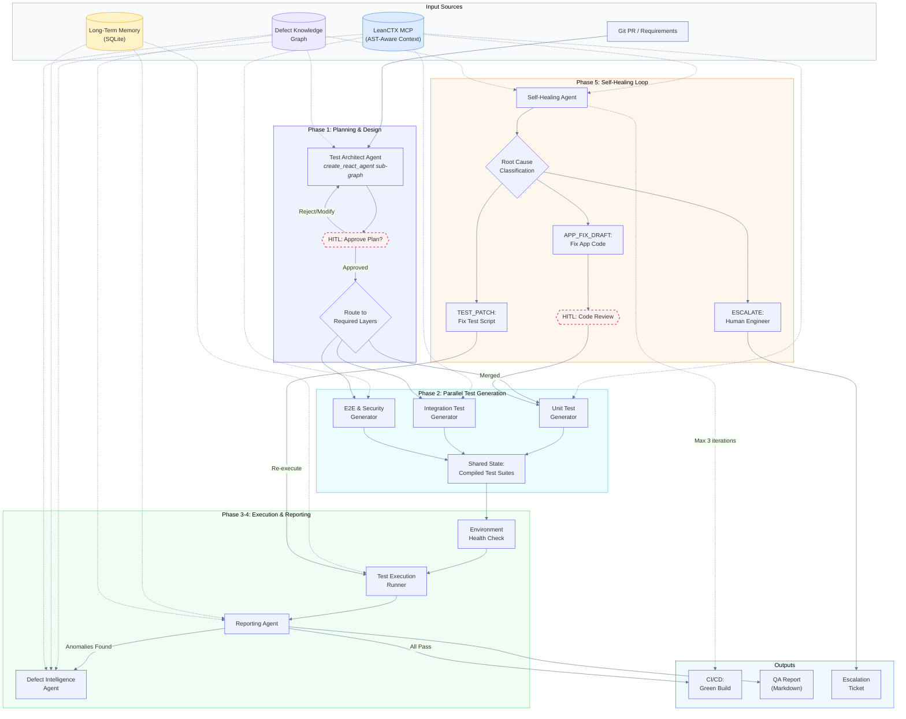
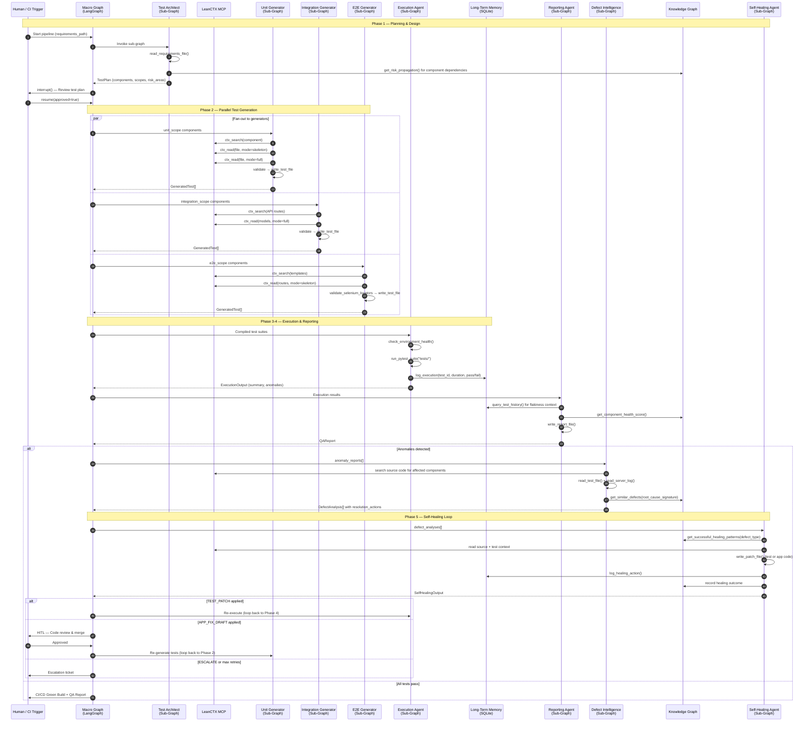
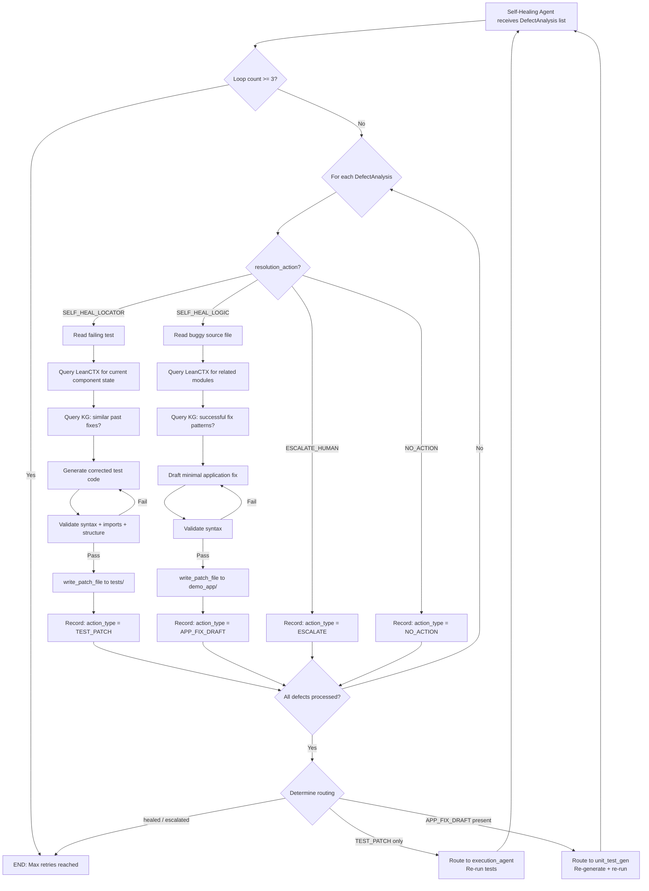

# QAura: Autonomous Software Testing & Self-Healing Multi-Agent System

## Complete Architecture Vision

> This document describes QAura's full architecture after incorporating all planned modifications:
> **LeanCTX MCP Integration**, **Long-Term Memory (LTM)**, **LangGraph Sub-Graph Agent Loops**,
> and the newly proposed **Defect Knowledge Graph**.

---

## 1. Project Overview

QAura is an autonomous, multi-agent AI system that models the entire **Software Testing Life Cycle (STLC)** as a continuous agent loop. Rather than executing brittle, hand-written test scripts, QAura deploys seven specialized agents orchestrated through a compiled LangGraph state machine. These agents plan, generate, execute, analyze, and self-heal tests — cycling through the loop until all tests pass or the system escalates to a human engineer.

### Core Capabilities (Post-Modification)

| Capability | Current Implementation | After Modifications |
|---|---|---|
| **Codebase Understanding** | ChromaDB + Ollama embeddings (`search_codebase`) | **LeanCTX MCP** — AST-aware, deduplicated, compressed context via `ctx_search`, `ctx_read`, `ctx_retrieve` |
| **Agent Architecture** | `AgentExecutor` (legacy LangChain) | **LangGraph Sub-Graphs** — each agent is a `create_react_agent` sub-graph with isolated `MessagesState` |
| **Historical Memory** | None (ephemeral per-run) | **Long-Term Memory (LTM)** — SQLite ledger tracking test executions, flakiness rates, and healing actions across runs |
| **Relationship Intelligence** | None | **Defect Knowledge Graph** — a graph structure mapping component dependencies, defect patterns, test coverage, and healing effectiveness |
| **Self-Healing** | Full Phase 5 loop with conditional routing | Enhanced with LTM-informed flakiness detection and Knowledge Graph-driven root cause correlation |
| **Multi-Dimensional Testing** | Unit (active), Integration & E2E (implemented, commented out) | All three generators active in parallel via `RunnableParallel`-style fan-out |

### Design Principles

1. **Macro/Micro Orchestration** — The high-level STLC workflow (macro) is a deterministic LangGraph state machine. Each agent internally runs an autonomous ReAct loop (micro) as a LangGraph sub-graph.
2. **State Isolation** — Agent sub-graphs operate on local `MessagesState`, preventing intermediate tool calls and scratchpad reasoning from bloating the shared `QAuraState`.
3. **Context Efficiency** — LeanCTX's AST-aware compression replaces raw vector search, reducing token usage by 60-80% while improving retrieval relevance.
4. **Persistent Intelligence** — The LTM + Knowledge Graph combination gives agents cross-run memory: flaky test history, proven healing patterns, and component risk propagation.
5. **Human-in-the-Loop (HITL)** — Strict approval gates at test plan review and application code merges ensure safety boundaries.

---

## 2. Project Structure

```
QAura/
├── agents/                          # Agent modules (one per STLC role)
│   ├── planning_agent.py            # Phase 1: Test Architect + HITL approval gate
│   ├── unit_test_gen.py             # Phase 2: Unit test generator
│   ├── integration_test_gen.py      # Phase 2: Integration test generator
│   ├── e2e_test_gen.py              # Phase 2: E2E & security test generator
│   ├── execution_agent.py           # Phase 3-4: Environment check + test runner
│   ├── reporting_agent.py           # Phase 4: QA report compiler
│   ├── defect_intelligence_agent.py # Phase 4: Root cause analyzer
│   └── self_healing_agent.py        # Phase 5: Auto-fix & loop-back controller
│
├── core/                            # Shared infrastructure
│   ├── graph.py                     # LangGraph state machine (macro orchestrator)
│   ├── state.py                     # QAuraState TypedDict + all Pydantic models
│   ├── tools.py                     # @tool definitions + tool lists per agent
│   ├── output_parsing.py            # robust_parse() — LLM-assisted JSON repair
│   ├── mcp_client.py                # [NEW] LeanCTX MCP client manager
│   └── memory_db.py                 # [NEW] SQLite long-term memory wrapper
│
├── knowledge_graph/                 # [NEW] Defect Knowledge Graph
│   ├── graph_store.py               # Graph data structure & persistence
│   ├── graph_builder.py             # Builds/updates graph from state events
│   └── graph_query.py               # Query interface exposed as agent tools
│
├── demo_app/                        # Application under test (FastAPI + SQLite)
│   ├── server.py                    # FastAPI routes and middleware
│   ├── auth.py                      # Authentication: register, login, sessions
│   ├── orders.py                    # Products, orders, calculations
│   ├── models.py                    # SQLite schema and seed data
│   └── templates/                   # HTML frontend (login, dashboard, etc.)
│
├── scripts/                         # Utility scripts
│   ├── codebase_vectordb.py         # [DEPRECATED] ChromaDB ingestion
│   └── codebase_rag.py              # [DEPRECATED] Standalone RAG query
│
├── tests/                           # Generated test files (output of Phase 2)
├── reports/                         # Generated QA reports (output of Phase 4)
├── conftest.py                      # Pytest path configuration
├── project_requirements.md          # Requirements for the demo app under test
├── .env.example                     # Environment variable template
└── QAura.md                         # Original project specification
```

### Key Changes from Current State

| Directory/File | Change | Reason |
|---|---|---|
| `core/mcp_client.py` | **New** | Synchronous wrapper around the async MCP SDK for LeanCTX |
| `core/memory_db.py` | **New** | SQLite-based long-term memory (test history + healing ledger) |
| `knowledge_graph/` | **New** | Defect Knowledge Graph for relationship intelligence |
| `core/tools.py` | **Modified** | Remove ChromaDB; add MCP tools (`ctx_search`, `ctx_read`, `ctx_retrieve`), LTM tools (`query_test_history`, `log_healing_action`), and KG tools (`query_component_dependencies`, `query_defect_patterns`) |
| `agents/*.py` | **Modified** | Replace `AgentExecutor` with `create_react_agent` sub-graphs; update prompts for LeanCTX tools |
| `scripts/` | **Deprecated** | ChromaDB ingestion no longer needed with LeanCTX |

---

## 3. The Defect Knowledge Graph — Introducing Relationship Intelligence

### Motivation

While the Long-Term Memory (LTM) stores **historical records** (flat rows: test X failed at time T with error E), it lacks the ability to answer **relational questions** like:

- *"Which components are most likely to break when `auth.py` changes?"*
- *"Has this exact root cause pattern been seen before in a different component?"*
- *"What healing strategy worked last time for this type of failure?"*

The **Defect Knowledge Graph (DKG)** fills this gap by modeling the semantic relationships between components, tests, defects, and healing actions as a directed graph.

### Graph Schema

```
Entities (Nodes):
  Component    — A source module (e.g., auth.py, orders.py)
  TestFile     — A generated test file (e.g., test_auth.py)
  Defect       — A specific anomaly instance (ANOM-001)
  HealingAction — A corrective action taken (TEST_PATCH, APP_FIX_DRAFT)
  RiskArea     — A domain risk (e.g., "SQL injection", "Session expiry")

Relationships (Edges):
  Component  --[DEPENDS_ON]-->   Component       (import/call dependencies)
  Component  --[BELONGS_TO]-->   RiskArea        (from test plan risk mapping)
  TestFile   --[COVERS]-->       Component       (test-to-component coverage)
  Defect     --[AFFECTS]-->      Component       (which component broke)
  Defect     --[DETECTED_BY]-->  TestFile        (which test caught it)
  Defect     --[CLASSIFIED_AS]--> str            (INFRASTRUCTURE | APP_DEFECT | DECAY)
  Defect     --[HAS_PATTERN]-->  Defect          (similar root cause signature)
  HealingAction --[FIXES]-->     Defect          (which defect was healed)
  HealingAction --[MODIFIES]-->  Component|Test  (what file was patched)
  HealingAction --[SUCCEEDED]--> bool            (did re-execution pass?)
```

### How Agents Use the Knowledge Graph

| Agent | Query | Value |
|---|---|---|
| **Test Architect** | `get_risk_propagation(component)` | When `auth.py` is changed, the KG shows that `orders.py` and `server.py` depend on it — so integration tests must cover those too |
| **Defect Intelligence** | `get_similar_defects(root_cause_signature)` | Before investigating from scratch, check if this failure pattern matches a previously diagnosed defect. Reuse the proven diagnosis |
| **Self-Healing** | `get_successful_healing_patterns(defect_type)` | Before attempting a fix, query which healing strategies have historically succeeded for this type of failure. Prioritize high-confidence approaches |
| **Reporting** | `get_component_health_score(component)` | Aggregate defect frequency, healing success rate, and flakiness into a per-component health score for the QA report |

### Implementation Approach

The DKG uses a lightweight in-memory graph structure (adjacency list) persisted to a JSON file. This avoids adding a heavyweight dependency like Neo4j while providing the relational query capability the agents need. The graph is built incrementally:

1. **At pipeline start** — `graph_builder.py` parses the test plan to create `Component` and `RiskArea` nodes with their relationships.
2. **After test generation** — `TestFile --[COVERS]--> Component` edges are added.
3. **After execution** — `Defect` nodes are created from anomaly reports.
4. **After healing** — `HealingAction` nodes record what was done, linked to both the defect and the modified file.
5. **Cross-run persistence** — The graph is serialized to JSON after each run and loaded at startup, accumulating knowledge over time.

---

## 4. Mermaid Chart — Full System Architecture



---

## 5. Sequence Diagram — Full Pipeline Execution



---

## 6. Agent Graph Structure & Workflow

### 6.1 Macro Orchestration — The STLC State Machine

The macro graph is a compiled `StateGraph` that manages the high-level workflow. It uses `QAuraState` (a `TypedDict`) as shared memory, with Pydantic models ensuring structured communication between agents.

```
State Machine Transitions:

  START
    │
    ▼
  test_architect ─────────────────────────────────────────────┐
    │                                                         │
    ▼                                                         │
  human_approval ──(rejected)──────────────────────────► END  │
    │                                                         │
    │ (approved)                                              │
    ▼                                                         │
  ┌─────────────────────────────────────┐                     │
  │  PARALLEL FAN-OUT (Phase 2)        │                     │
  │  ┌─── unit_test_gen ───┐           │                     │
  │  ├─── integration_gen ──┤ ──► JOIN │                     │
  │  └─── e2e_gen ─────────┘           │                     │
  └────────────────────────────────────┘                     │
    │                                                         │
    ▼                                                         │
  execution_agent                                             │
    │                                                         │
    ▼                                                         │
  reporting_agent ──(no anomalies)──────────────────────► END │
    │                                                         │
    │ (anomalies found)                                       │
    ▼                                                         │
  defect_intelligence_agent                                   │
    │                                                         │
    ▼                                                         │
  self_healing_agent                                          │
    │                                                         │
    ├──(healed / escalated / max_retries=3)──────────────► END│
    │                                                         │
    ├──(TEST_PATCH only)──► execution_agent  (loop Phase 4)   │
    │                                                         │
    └──(APP_FIX_DRAFT)────► unit_test_gen   (loop Phase 2) ──┘
```

### 6.2 Micro Orchestration — The ReAct Agent Sub-Graph

After the Agent Loop refactoring, each agent internally runs as a **LangGraph sub-graph** using `create_react_agent`. This replaces the legacy `AgentExecutor`.

```
┌─────────────────────────────────────────────────┐
│  Agent Sub-Graph (e.g., Unit Test Generator)    │
│                                                 │
│    ┌─────────────┐                              │
│    │   START      │                              │
│    └──────┬──────┘                              │
│           ▼                                      │
│    ┌─────────────┐      ┌───────────────┐       │
│    │  LLM Call   │─────►│  Tool Calls   │       │
│    │  (Reason)   │◄─────│  (Act)        │       │
│    └──────┬──────┘      └───────────────┘       │
│           │ (loop until done)                    │
│           ▼                                      │
│    ┌─────────────┐                              │
│    │  Final      │                              │
│    │  Response   │                              │
│    └──────┬──────┘                              │
│           ▼                                      │
│    ┌─────────────┐                              │
│    │   END        │                              │
│    └─────────────┘                              │
│                                                 │
│  Internal State: MessagesState (isolated)       │
│  External I/O:   Returns final text to macro    │
└─────────────────────────────────────────────────┘
```

**Bridge Pattern** — The macro node function acts as a translator:
1. Extracts relevant fields from `QAuraState` into a human prompt.
2. Invokes the sub-graph with `{"messages": [("user", prompt)]}`.
3. Parses the final message via `robust_parse()` into a Pydantic model.
4. Returns a dict that updates `QAuraState`.

### 6.3 Agent Inventory

| Agent | Phase | Sub-Graph Tools | Input from State | Output to State |
|---|---|---|---|---|
| **Test Architect** | 1 | `read_requirements_file`, KG: `get_risk_propagation` | `requirements_path` | `test_plan` |
| **HITL Approval** | 1 | *(interrupt gate)* | `test_plan` | `plan_approved` |
| **Unit Test Gen** | 2 | `ctx_search`, `ctx_read`, `ctx_retrieve`, `validate_python_syntax`, `validate_imports`, `check_test_structure`, `write_test_file` | `test_plan.unit_scope` | `unit_tests` |
| **Integration Test Gen** | 2 | `ctx_search`, `ctx_read`, `ctx_retrieve`, `validate_python_syntax`, `validate_imports`, `check_test_structure`, `write_test_file` | `test_plan.integration_scope` | `integration_tests` |
| **E2E & Security Gen** | 2 | `ctx_search`, `ctx_read`, `ctx_retrieve`, `validate_python_syntax`, `validate_imports`, `check_test_structure`, `write_test_file`, `validate_selenium_locators` | `test_plan.e2e_scope` | `e2e_tests` |
| **Execution Agent** | 3-4 | `check_environment_health`, `run_pytest_suite`, LTM: `log_execution` | `unit_tests`, `integration_tests`, `e2e_tests` | `execution_summary`, `coverage_assessment`, `anomaly_reports`, `execution_memory` |
| **Reporting Agent** | 4 | `write_report_file`, `get_timestamp`, LTM: `query_test_history`, KG: `get_component_health_score` | `execution_summary`, `coverage_assessment`, `anomaly_reports` | `qa_report`, `report_path` |
| **Defect Intelligence** | 4 | `ctx_search`, `read_test_file`, `read_server_log`, KG: `get_similar_defects` | `anomaly_reports` | `defect_analyses` |
| **Self-Healing Agent** | 5 | `ctx_search`, `read_test_file`, `read_source_file`, `write_patch_file`, `validate_python_syntax`, `validate_imports`, `check_test_structure`, `search_git_log`, KG: `get_successful_healing_patterns`, LTM: `log_healing_action` | `defect_analyses` | `healing_actions`, `healing_status`, `healing_loop_count` |

### 6.4 Shared State Schema (`QAuraState`)

```python
class QAuraState(TypedDict):
    # Phase 1 — Planning
    requirements_path: str
    test_plan: TestPlan | None
    plan_approved: bool
    messages: Annotated[list, operator.add]     # Append-only log

    # Phase 2 — Test Generation
    unit_tests: List[GeneratedTest]
    integration_tests: List[GeneratedTest]
    e2e_tests: List[GeneratedTest]

    # Phase 3-4 — Execution & Reporting
    environment_status: dict
    execution_summary: ExecutionResultsSummary | None
    coverage_assessment: CoverageConfidenceAssessment | None
    anomaly_reports: List[StructuredAnomalyReport]
    execution_memory: List[ExecutionMemoryUpdate]
    qa_report: QAReport | None
    report_path: str

    # Phase 4 — Defect Analysis
    defect_analyses: List[DefectAnalysis]

    # Phase 5 — Self-Healing
    healing_actions: List[HealingAction]
    healing_loop_count: int                     # Max 3 iterations
    healing_status: str                         # healed | escalated | partial
```

### 6.5 Data Layer Architecture

```
┌──────────────────────────────────────────────────────────────────┐
│                        Agent Layer                               │
│  ┌────────┐ ┌────────┐ ┌────────┐ ┌────────┐ ┌────────┐        │
│  │Planning│ │ Unit   │ │ Exec   │ │ Defect │ │ Heal   │  ...   │
│  └───┬────┘ └───┬────┘ └───┬────┘ └───┬────┘ └───┬────┘        │
│      │          │          │          │          │               │
├──────┼──────────┼──────────┼──────────┼──────────┼───────────────┤
│      │   Tool Layer (@tool wrappers)  │          │               │
│      │          │          │          │          │               │
│  ┌───▼──────────▼──┐  ┌───▼───┐  ┌───▼──────────▼───┐          │
│  │  LeanCTX MCP    │  │  LTM  │  │ Knowledge Graph  │          │
│  │  (ctx_search,   │  │(SQLite│  │ (JSON-persisted  │          │
│  │   ctx_read,     │  │ log,  │  │  adjacency list) │          │
│  │   ctx_retrieve) │  │ query)│  │                  │          │
│  └────────┬────────┘  └───┬───┘  └────────┬─────────┘          │
│           │               │               │                     │
│  ┌────────▼────────┐  ┌───▼──────────┐  ┌─▼──────────────┐     │
│  │ lean-ctx mcp    │  │ history.     │  │ defect_graph.  │     │
│  │ (subprocess)    │  │ sqlite3      │  │ json           │     │
│  └─────────────────┘  └──────────────┘  └────────────────┘     │
└──────────────────────────────────────────────────────────────────┘
```

### 6.6 The Self-Healing Loop — Decision Tree



---

## 7. Summary of All Modifications

| Modification | What It Adds | Impact |
|---|---|---|
| **LeanCTX MCP** | AST-aware code search via MCP protocol | Replaces ChromaDB; reduces token usage 60-80%; eliminates Ollama dependency |
| **LangGraph Sub-Graphs** | Each agent becomes a `create_react_agent` sub-graph | State isolation; modern architecture; fine-grained checkpointing |
| **Long-Term Memory** | SQLite-backed test execution history and healing ledger | Cross-run flakiness detection; historical healing success rates |
| **Defect Knowledge Graph** | Relationship graph mapping components, defects, tests, and healing patterns | Dependency-aware risk propagation; pattern-based root cause correlation; healing strategy recommendation |

Together, these modifications transform QAura from a **single-run pipeline** into a **continuously learning testing system** that gets smarter with every execution cycle.
